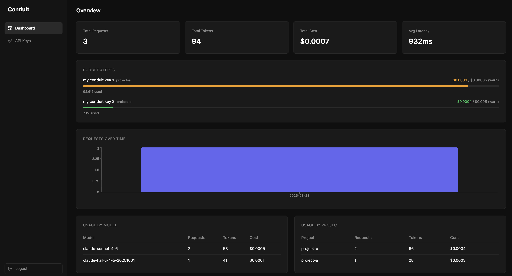

# Conduit

An open-source AI gateway and observability platform. Route requests to any LLM provider through a single endpoint, with automatic token logging, cost tracking, and a built-in dashboard.



## Features

- 🔀 **Multi-provider routing** — route requests across any LLM provider through a single endpoint
- 📊 **Usage tracking** — token counts, cost, and latency per request, per project
- 🔑 **API key management** — virtual keys with per-project assignment, rate limits, and spend limits
- ⚡ **Rate limiting** — Redis-backed request throttling with per-key configuration
- 💰 **Cost alerts** — monthly spend limits per key with block or warn actions and webhook notifications
- 📈 **Dashboard** — visualize spend, volume, latency, and budget usage in real time
- 🌊 **Streaming** — passthrough streaming with accurate token and cost logging
- 🔐 **Auth** — email and password registration with session management, keys scoped per user

## Tech Stack

- **Backend** — Python, FastAPI, SQLAlchemy, asyncpg, bcrypt
- **Database** — PostgreSQL
- **Cache** — Redis
- **Frontend** — React, TypeScript, Vite, Recharts, Lucide
- **Infrastructure** — Docker, Docker Compose, Nginx

## Who is this for

Conduit is for developers who embed LLM calls in their apps and want visibility into usage, cost, and performance — without sending data to a third party.

**Solo developers** building AI-powered apps — track costs per project, set budget limits, get alerted before you overspend.

**Small teams** with multiple AI products — one self-hosted gateway for all LLM traffic, with per-project breakdowns.

**Developer tools** like code reviewers or assistants — monitor token usage and enforce rate limits per API key.

Conduit works anywhere you control the code making the API call. Your API keys and prompts never leave your own infrastructure.

### What Conduit works with

✅ Your own apps and scripts  
✅ Claude Code (terminal)  
✅ Cursor, Windsurf, VS Code AI extensions  
✅ Any tool that supports a custom base URL and API key  

❌ claude.ai (closed product, no API access)  
❌ Claude or ChatGPT mobile apps  

### One key per project

Each Conduit API key is assigned to a project at creation. All requests made with that key are automatically attributed to that project — no headers needed.
```python
import anthropic

client = anthropic.Anthropic(
    api_key="cdt-your-conduit-key",
    base_url="http://your-conduit-server"
)
```

Create separate keys for separate projects. Revoke, rate limit, or set spend limits per key independently.

### Example — Claude Code

Route all your Claude Code terminal sessions through Conduit:
```bash
export ANTHROPIC_API_KEY="cdt-your-conduit-key"
export ANTHROPIC_BASE_URL="http://localhost:8000"
claude
```

Every coding session is now tracked in your Conduit dashboard.

## Getting Started

### Prerequisites
- Docker Desktop

### Setup

1. Clone the repo
```bash
git clone https://github.com/yourusername/conduit.git
cd conduit
```

2. Set up environment variables
```bash
cp .env.example .env
```
Fill in your Anthropic and OpenAI API keys in `.env`

3. Start everything
```bash
docker compose up --build
```

4. Open `http://localhost:3000`

On first run you'll be prompted to create an account. Then create your first API key from the **API Keys** page and start routing requests through Conduit.

## Usage

### 1. Create an account
Open `http://localhost:3000` and register with your email and password.

### 2. Create an API key
Go to **API Keys**, fill in a name and project, and hit **Create Key**. Optionally set rate limits and spend limits per key.

### 3. Point your app at Conduit
```python
import anthropic

client = anthropic.Anthropic(
    api_key="cdt-your-conduit-key",
    base_url="http://localhost:8000"
)

response = client.messages.create(
    model="claude-sonnet-4-6",
    max_tokens=1024,
    messages=[{"role": "user", "content": "Hello!"}]
)
```

All requests are automatically logged with token usage, cost, and latency.

### 4. Monitor usage

Open the dashboard to see:
- Total requests, tokens, cost, and average latency
- Spend vs budget per key with color-coded progress bars
- Usage breakdown by model and project
- Request volume over time

## Updating Pricing

Pricing is stored in `pricing.json` at the root of the project. Update the values and restart the server — no redeployment needed.

Sources:
- Anthropic: https://anthropic.com/pricing
- OpenAI: https://platform.openai.com/docs/pricing

## Roadmap

- [ ] Google Gemini support (requires request/response format translation)
- [ ] Email notifications for cost alerts
- [ ] Email verification on registration
- [ ] Team support — multiple users per instance
- [ ] OpenTelemetry support
- [ ] Cloud deployment guide

## License

MIT